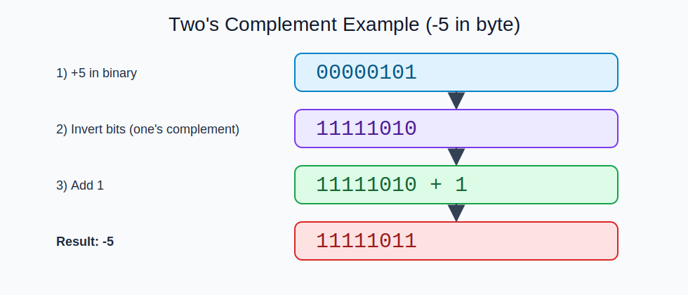
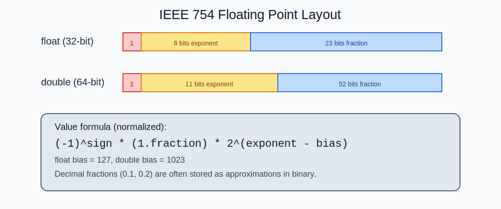

# 기본 자료형 (Primitive Types)

## 학습 목표
- Java의 기본 자료형 8가지를 메모리 크기, 표현 범위, 사용 맥락까지 포함해 설명할 수 있다.
- 정수의 2의 보수 표현과 오버플로우 동작을 이해한다.
- 실수의 IEEE 754 부동소수점 표현과 정밀도 한계를 이해한다.
- 실무에서 타입을 선택할 때 발생하는 대표 실수를 피할 수 있다.

---

## 1. 기본 자료형이란

Java 타입은 크게 두 가지로 나뉜다.

1. 기본 자료형(Primitive Type)  
2. 참조 자료형(Reference Type, 예: `String`, 배열, 클래스 객체)

기본 자료형은 값 자체를 저장하는 타입이며, Java 언어 차원에서 고정된 규칙을 가진다.

기본 자료형 8가지:
- 정수형: `byte`, `short`, `int`, `long`
- 실수형: `float`, `double`
- 문자형: `char`
- 논리형: `boolean`

---

## 2. 8가지 타입 요약표

| 타입 | 크기 | 범위/의미 | 대표 용도 |
|---|---:|---|---|
| `byte` | 8bit | -128 ~ 127 | 바이트 단위 데이터, 네트워크/파일 I/O |
| `short` | 16bit | -32,768 ~ 32,767 | 특수한 메모리 최적화 상황 |
| `int` | 32bit | -2^31 ~ 2^31-1 | 일반 정수 계산의 기본 |
| `long` | 64bit | -2^63 ~ 2^63-1 | 큰 정수, 시간/카운트/ID |
| `float` | 32bit | IEEE 754 단정밀도 | 메모리 절약이 중요한 실수 데이터 |
| `double` | 64bit | IEEE 754 배정밀도 | 일반 실수 계산의 기본 |
| `char` | 16bit | 0 ~ 65,535 (UTF-16 코드 유닛) | 단일 문자 코드 값 처리 |
| `boolean` | JVM 구현 의존 | `true` / `false` | 조건 분기, 상태 값 |

주의:
- Java 스펙상 `boolean`의 "메모리 크기"는 언어 레벨에서 고정하지 않는다.
- 로컬 변수는 자동 초기화되지 않는다. 반드시 값을 대입해야 사용 가능하다.
- 인스턴스/클래스 필드는 타입 기본값이 적용된다(`int`는 `0`, `boolean`은 `false` 등).

---

## 3. 정수형 내부 표현: 2의 보수 (Two's Complement)

Java 정수형(`byte/short/int/long`)은 **부호 있는 2의 보수**로 저장된다.

### 3.1 왜 2의 보수를 쓰는가
- 덧셈 회로를 단순하게 구성 가능
- `+0`과 `-0`이 따로 생기지 않음
- 뺄셈을 덧셈으로 통일 가능

### 3.2 `byte` 예시
- `byte`는 8비트
- 범위: `-128` ~ `127`
- 이진수에서 최상위 비트(MSB)가 부호 역할을 한다.

예:
- `00000001` -> `1`
- `01111111` -> `127`
- `11111111` -> `-1`
- `10000000` -> `-128`

### 3.3 음수 표현 방식
`-x`를 저장할 때:
1. `x`의 이진수 작성
2. 비트 반전(1의 보수)
3. `+1` 수행

예: `-5`
- `5`  : `00000101`
- 반전 : `11111010`
- +1   : `11111011` (이 값이 -5)



음수 비트 표현이 "반전 + 1"로 만들어지는 과정을 단계별로 보여준다.

### 3.4 오버플로우 동작
Java 정수 오버플로우는 예외를 던지지 않고 **비트가 잘려 래핑(wrap around)** 된다.

```java
int max = Integer.MAX_VALUE;   //  2147483647
int next = max + 1;            // -2147483648
System.out.println(next);
```

실무 포인트:
- 금융/정산/카운터에서는 범위 검증 또는 `Math.addExact` 사용 고려
- 큰 금액은 `int` 대신 `long` 또는 `BigInteger`/`BigDecimal` 설계 검토

---

## 4. 실수형 내부 표현: IEEE 754 부동소수점

`float`, `double`은 십진 실수를 "정확히 저장"하는 타입이 아니라,  
2진 부동소수점 근사값으로 저장하는 타입이다.

### 4.1 비트 구조
- `float` (32비트): 부호 1 + 지수 8 + 가수 23
- `double` (64비트): 부호 1 + 지수 11 + 가수 52

저장 개념(정규화 수):

```text
값 = (-1)^sign * (1.fraction) * 2^(exponent-bias)
```



`float`/`double`의 sign, exponent, fraction 영역과 계산 공식을 함께 정리한 그림이다.

### 4.2 정밀도
- `float`: 대략 6~7자리 십진 정밀도
- `double`: 대략 15~16자리 십진 정밀도

그래서 `double`이 Java 일반 실수 계산 기본값이다.

### 4.3 왜 0.1 + 0.2가 0.3이 아닐 수 있는가
`0.1`, `0.2`는 2진수로 유한 표현이 어려워 근사치로 저장된다.

```java
double x = 0.1 + 0.2;
System.out.println(x); // 0.30000000000000004
```

비교는 다음처럼 허용 오차(EPSILON) 기반으로 처리한다.

```java
double a = 0.1 + 0.2;
double b = 0.3;
boolean same = Math.abs(a - b) < 1e-12;
```

### 4.4 특수값
- `Infinity`, `-Infinity`
- `NaN` (Not a Number)
- `-0.0` (부호 있는 0)

`NaN`은 자기 자신과도 같지 않다.

```java
double n = Double.NaN;
System.out.println(n == n); // false
```

검사는 `Double.isNaN(n)`을 사용한다.

### 4.5 돈 계산에서 실수형을 피하는 이유
금액 계산은 반올림 규칙과 정확도가 중요하므로 `float/double`이 부적합할 수 있다.  
일반적으로 `BigDecimal`을 사용한다.

---

## 5. 문자형 `char`와 유니코드

`char`는 Java에서 16비트 정수형처럼 동작하는 문자 타입이다.

- 내부적으로 UTF-16 코드 유닛 1개 저장
- 범위: `\u0000` ~ `\uFFFF`

```java
char c1 = 'A';
char c2 = '\uAC00'; // 가
int code = c2;      // 코드값 확인 가능
```

주의:
- 일부 이모지/확장 문자(보충 평면)는 UTF-16에서 `char` 1개로 표현되지 않을 수 있다.
- "사용자 눈에 보이는 문자 1개"와 "char 1개"가 항상 같지 않다.

---

## 6. 논리형 `boolean`

`boolean`은 `true`/`false`만 가진다.

- 조건식, 제어문(`if`, `while`), 상태 플래그에서 사용
- C/C++처럼 정수와 자동 변환되지 않는다.

```java
boolean ok = true;
// int x = ok;   // 컴파일 오류
```

---

## 7. 리터럴 표기법 (실무에서 자주 쓰는 형태)

### 7.1 정수 리터럴
- 10진수: `10`
- 16진수: `0xFF`
- 8진수: `012` (주의: 헷갈리기 쉬움)
- 2진수: `0b1010`
- 큰 값 구분: `_` 사용 가능 (`1_000_000`)
- `long`은 `L` 권장: `3_000_000_000L`

### 7.2 실수 리터럴
- 기본은 `double`: `3.14`
- `float`는 `F` 접미사 필수: `3.14F`
- 지수 표기: `6.02e23`

### 7.3 문자/문자열
- `char`: `'A'`, `'\n'`
- `String`: `"A"`  
작은따옴표와 큰따옴표를 혼동하면 컴파일 오류가 난다.

---

## 8. 연산 시 자동 형변환 (Promotion) 핵심

정수 연산에서는 `byte`, `short`, `char`가 연산 전에 `int`로 승격된다.

```java
byte a = 10;
byte b = 20;
// byte c = a + b; // 컴파일 오류 (a+b 결과는 int)
int c = a + b;     // 가능
```

`long`, `float`, `double`이 섞이면 더 큰 범위/정밀도 타입으로 승격된다.

실무 포인트:
- "왜 갑자기 타입 오류가 나지?"의 원인이 승격 규칙인 경우가 많다.
- 캐스팅은 마지막 수단이며, 정보 손실 가능성을 먼저 검토해야 한다.

---

## 9. 타입 선택 실무 가이드

1. 일반 정수는 `int`, 큰 범위는 `long`
2. 일반 실수는 `double`, 정밀한 금액은 `BigDecimal`
3. 문자 하나는 `char`보다 실제로 `String`이 더 안전한 경우가 많음
4. 메모리 최적화 때문에 무조건 `byte/short`를 쓰지 말고, 가독성과 연산 비용까지 고려
5. 경계값(`MAX_VALUE`, `MIN_VALUE`) 테스트를 습관화

---

## 10. 정리
- 기본 자료형은 단순 문법이 아니라, JVM 위에서 값이 표현되는 방식 자체와 연결된다.
- 정수는 2의 보수, 실수는 IEEE 754 기반이라는 점을 이해해야 버그를 줄일 수 있다.
- 타입 선택은 "컴파일만 되면 된다"가 아니라 범위, 정밀도, 유지보수성을 함께 봐야 한다.
