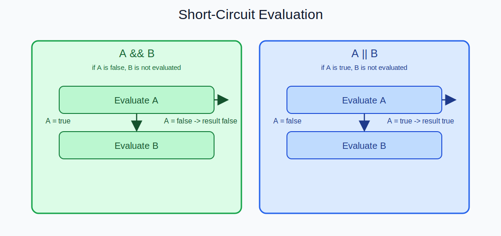
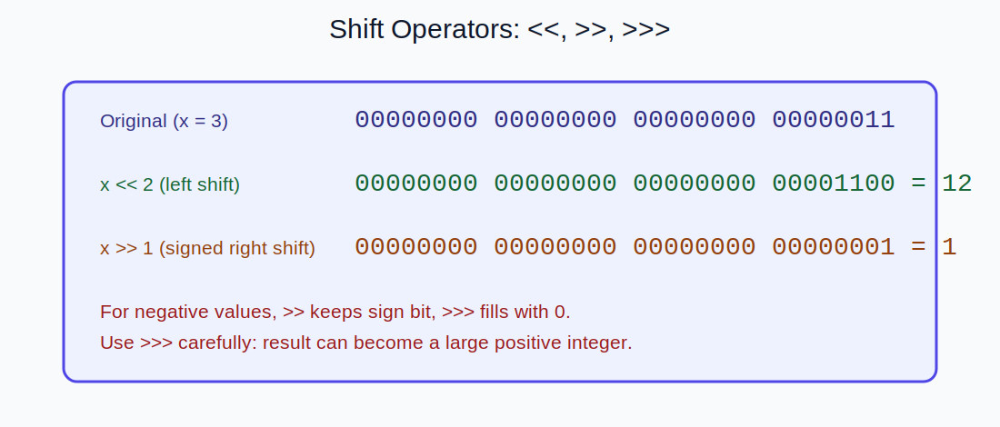

# 연산자

## 학습 목표
- Java 연산자 체계를 "문법 목록"이 아니라 "평가 규칙" 관점으로 설명할 수 있다.
- 산술/비교/논리/비트/시프트/대입/삼항 연산자의 동작 차이를 이해한다.
- 오버플로우, 단락 평가, 복합 대입의 숨은 캐스팅 등 실무 버그 포인트를 피할 수 있다.

---

## 1. 연산자란

연산자는 피연산자(operand)에 규칙을 적용해 결과를 만드는 문법 요소다.  
실무에서는 연산자 자체보다 **평가 순서**, **타입 승격**, **부수 효과(side effect)**를 이해하는 것이 중요하다.

---

## 2. 산술 연산자 (`+`, `-`, `*`, `/`, `%`)

### 2.1 기본 동작

```java
int a = 7;
int b = 3;
System.out.println(a + b); // 10
System.out.println(a - b); // 4
System.out.println(a * b); // 21
System.out.println(a / b); // 2
System.out.println(a % b); // 1
```

정수 나눗셈은 소수부를 버린다.

### 2.2 0으로 나누기

정수:

```java
int x = 10 / 0; // ArithmeticException
```

실수:

```java
double x = 10.0 / 0.0;  // Infinity
double y = 0.0 / 0.0;   // NaN
```

정수/실수는 에러 처리 방식이 다르므로 구분해야 한다.

### 2.3 오버플로우

```java
int max = Integer.MAX_VALUE;
System.out.println(max + 1); // 음수로 래핑
```

Java 정수 오버플로우는 예외 없이 wrap-around 된다.

---

## 3. 증감 연산자 (`++`, `--`)

### 3.1 전위/후위 차이

```java
int i = 5;
int a = ++i; // i를 먼저 6으로 만들고 a=6
int b = i++; // b=6 대입 후 i=7
```

### 3.2 실무 권장

복잡한 식 안에서 `i++`를 섞으면 가독성이 급격히 떨어진다.

```java
// 지양
arr[i++] = arr[++i] + i--;
```

증감과 계산은 분리하는 편이 안전하다.

---

## 4. 비교 연산자 (`==`, `!=`, `>`, `<`, `>=`, `<=`)

비교 결과는 항상 `boolean`이다.

```java
int age = 20;
boolean adult = age >= 19;
```

### 4.1 실수 비교 주의

```java
double a = 0.1 + 0.2;
System.out.println(a == 0.3); // false 가능
```

실수는 오차가 있으므로 허용 오차 기반 비교를 사용한다.

```java
boolean same = Math.abs(a - 0.3) < 1e-12;
```

---

## 5. 동등성 비교: `==` vs `equals`

## 5.1 primitive

`==`는 값 비교다.

```java
int x = 10;
int y = 10;
System.out.println(x == y); // true
```

### 5.2 reference

`==`는 참조 동일성(같은 객체인가)을 비교한다.

```java
String s1 = new String("java");
String s2 = new String("java");
System.out.println(s1 == s2);      // false
System.out.println(s1.equals(s2)); // true
```

문자열/값 객체의 내용 비교는 `equals`가 기본이다.

---

## 6. 논리 연산자와 단락 평가

## 6.1 `&&`, `||`, `!`

```java
boolean a = true;
boolean b = false;
System.out.println(a && b); // false
System.out.println(a || b); // true
System.out.println(!a);     // false
```

### 6.2 단락 평가 (Short-circuit)

- `A && B`: A가 false면 B 평가 안 함
- `A || B`: A가 true면 B 평가 안 함

```java
if (obj != null && obj.isValid()) {
    // obj null 체크 후 접근
}
```

이 패턴이 NPE를 줄이는 핵심이다.

### 6.3 `&`, `|`와의 차이

`&`, `|`는 boolean에도 쓸 수 있지만 양쪽을 항상 평가한다.

```java
if (obj != null & obj.isValid()) { // 지양: null이면 NPE 위험
}
```

조건식에서는 보통 `&&`, `||`를 사용한다.



`&&`와 `||`에서 오른쪽 피연산자를 생략 평가하는 조건을 시각화한 그림이다.

---

## 7. 비트 연산자 (`&`, `|`, `^`, `~`)

정수 비트를 직접 다룬다.

```java
int a = 0b1100;
int b = 0b1010;
System.out.println(a & b); // 0b1000
System.out.println(a | b); // 0b1110
System.out.println(a ^ b); // 0b0110
System.out.println(~a);    // 비트 반전
```

용도:
- 플래그 마스킹
- 네트워크/파일 포맷 파싱
- 성능 민감한 로우레벨 처리

---

## 8. 시프트 연산자 (`<<`, `>>`, `>>>`)

### 8.1 왼쪽 시프트 `<<`

비트를 왼쪽으로 밀고 빈칸을 0으로 채운다.

```java
int x = 3;       // 0011
int y = x << 2;  // 1100 -> 12
```

### 8.2 부호 유지 오른쪽 시프트 `>>`

부호 비트를 유지하며 오른쪽 이동한다.

```java
int x = -8;
int y = x >> 1; // -4
```

### 8.3 부호 없는 오른쪽 시프트 `>>>`

왼쪽을 0으로 채운다.

```java
int x = -8;
int y = x >>> 1; // 큰 양수
```

암호화, 해시, 비트 포맷 처리에서 중요하다.



`<<`, `>>`, `>>>`가 비트를 어떻게 이동시키는지 예제로 정리한 그림이다.

---

## 9. 대입/복합 대입 연산자

기본 대입:

```java
int n = 10;
```

복합 대입:

```java
n += 5;
n *= 2;
```

주의 포인트:

```java
short s = 1;
s += 1;       // 가능 (내부 캐스팅)
// s = s + 1; // 컴파일 오류 (int 결과)
```

복합 대입에는 숨은 캐스팅 규칙이 있어 결과를 반드시 확인해야 한다.

---

## 10. 삼항 연산자 (`조건 ? 값1 : 값2`)

단순 분기값 선택에 유용하다.

```java
int score = 85;
String grade = score >= 80 ? "PASS" : "FAIL";
```

복잡한 삼항 중첩은 가독성을 해치므로 `if`로 바꾸는 것이 낫다.

---

## 11. 우선순위와 결합 방향

우선순위를 전부 암기하는 것보다 원칙을 지키는 게 좋다.

1. 애매하면 괄호를 쓴다.
2. 부수 효과가 있는 연산(`++`, `--`, 대입)을 식에서 분리한다.
3. 한 줄 식이 길어지면 중간 변수를 도입한다.

예:

```java
// 지양
boolean ok = a + b * c > d && e != 0 || f < g;

// 권장
int calc = a + (b * c);
boolean left = calc > d;
boolean right = e != 0;
boolean ok = (left && right) || (f < g);
```

---

## 12. 자주 나오는 실무 버그

1. 문자열 비교를 `==`로 수행  
2. 정수 나눗셈 결과를 실수라고 착각  
3. `&&` 대신 `&`를 써서 불필요 평가/NPE 발생  
4. 오버플로우를 고려하지 않은 카운터/금액 연산  
5. 복합 대입의 자동 캐스팅을 모르고 타입 버그 발생

---

## 13. 정리

- 연산자의 핵심은 문법보다 평가 규칙과 타입 규칙이다.
- 단락 평가, 동등성 비교, 오버플로우 동작을 정확히 아는 것이 버그 예방에 직접 연결된다.
- 읽기 쉬운 식을 작성하는 습관이 유지보수성과 안정성을 결정한다.

