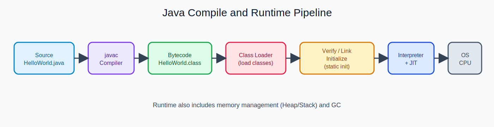

  
CH LECTURE - SLIDE 01

  <h2 style="margin: 10px 0 8px; border: 0; color: #ffffff; font-size: clamp(34px, 5vw, 52px);">강의는 들었는데, 왜 프로젝트는 안 끝날까?</h2>
  

    이 수업은 설명만 하지 않습니다. 
    수업 시간 안에 바로 구현해서, 끝까지 완성합니다.
  

---

<table>
  <tr>
    <td style="width: 50%;">
      <h3 style="margin-top: 4px; border: 0;">기존 학습의 한계</h3>
      
개념 이해는 되는데 코드로 옮기는 순간 멈춥니다.

      
단편 지식이 쌓여도, 서비스 단위 연결 경험이 부족합니다.

    </td>
    <td style="width: 50%;">
      <h3 style="margin-top: 4px; border: 0;">이 강의의 방식</h3>
      
개념 설명 직후 즉시 구현합니다.

      
기능 단위 결과물을 누적해 실제 프로젝트로 마무리합니다.

    </td>
  </tr>
</table>

---

## 핵심 메시지

1. Java부터 Spring, 인증, 배포까지 한 흐름으로 연결
2. 실전 코드 리뷰와 개선 피드백으로 결과물 퀄리티 상승
3. 취업 포트폴리오/외주 대응이 가능한 수준까지 밀도 있게 진행

---

<table>
  <tr>
    <td style="width: 50%;">
      
    </td>
    <td style="width: 50%;">
      
    </td>
  </tr>
</table>

---

  <a href="./index.md">목차로</a>
  <a href="./02_결과물.md">다음 슬라이드: 결과물 보기 →</a>

