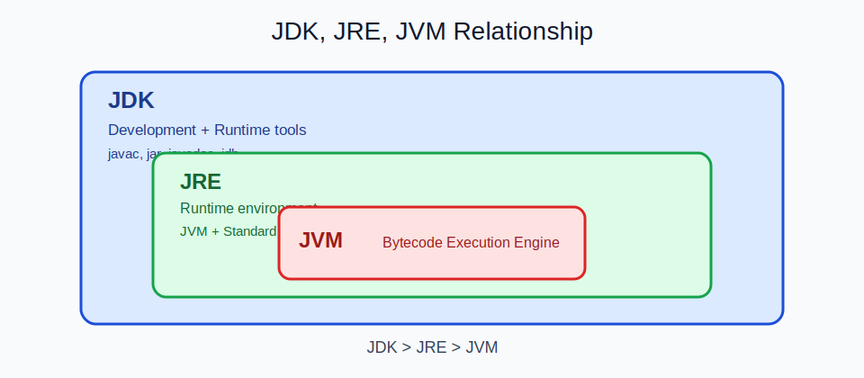

  
CH LECTURE | SLIDE 02

  <h2 style="margin: 10px 0 6px; border: 0; color: #ffffff;">직접 제작한 개념자료 + 실습문서 활용</h2>
  

    강의마다 문서와 시각자료를 함께 제공합니다. 
    수강 후에도 복습 가능한 구조로 누적됩니다.
  

---

## 자료 구성 (ch_lecture 기준)

| 파트 | 구성 |
| --- | --- |
| Java Basic | 1장~16장 (문법, OOP, API, 컬렉션, Stream, JDBC, 스레드) |
| JavaScript Basic | HTML/CSS/JS 기초부터 DOM/비동기/HTTP/프로젝트 |
| Web Basic | WAS/JSP/MVC/Session/Filter/Listener/MyBatis 실습 |
| Spring Series | SSR, Security, OAuth2, JWT, STOMP, CSR Final 프로젝트 |

---

## 강의 자료 예시

<table>
  <tr>
    <td></td>
    <td></td>
  </tr>
  <tr>
    <td></td>
    <td></td>
  </tr>
</table>

---

## 실제 결과물 화면

<table>
  <tr>
    <td></td>
    <td></td>
  </tr>
  <tr>
    <td></td>
    <td></td>
  </tr>
</table>

---

  

    단순 설명 문서가 아니라, "실습에 바로 쓰는 자료"와 "실제 산출물"이 함께 남습니다. 
    포트폴리오/면접/프로젝트 설명에 바로 활용 가능한 구성을 목표로 합니다.
  

---

  <a href="./01_후킹.md">← 이전 슬라이드</a>
  <a href="./03_커리큘럼.md">다음 슬라이드: 커리큘럼 →</a>

