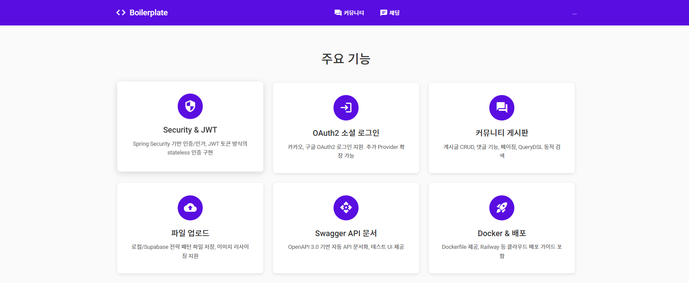
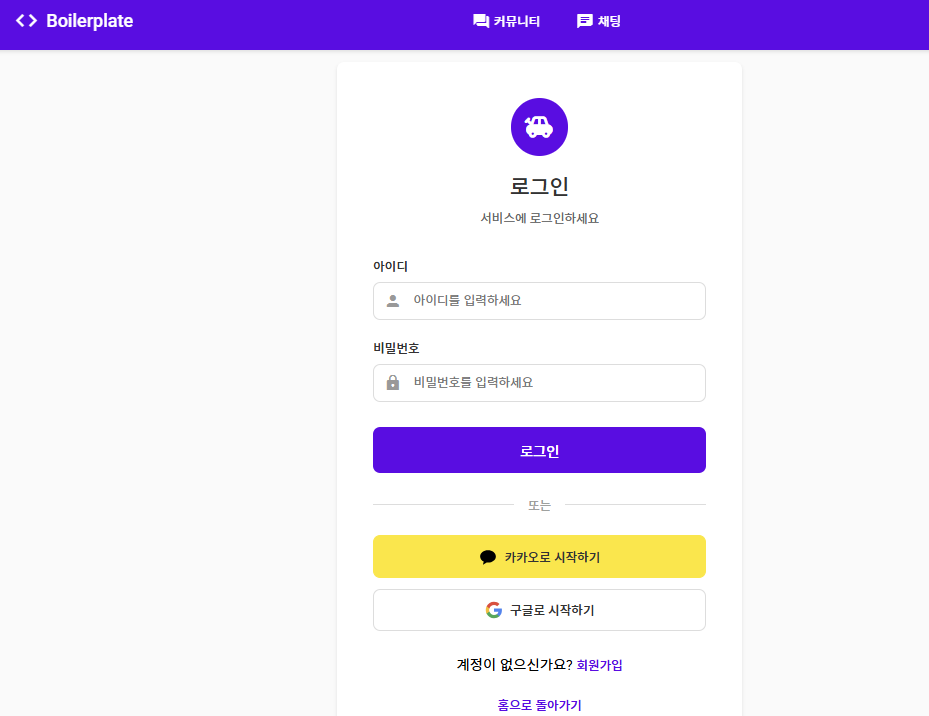
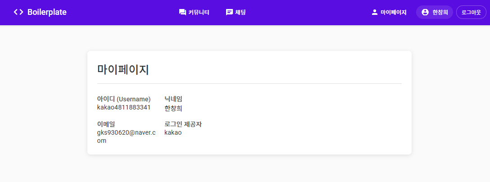
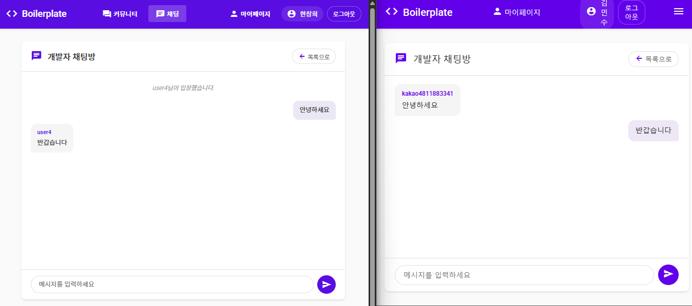
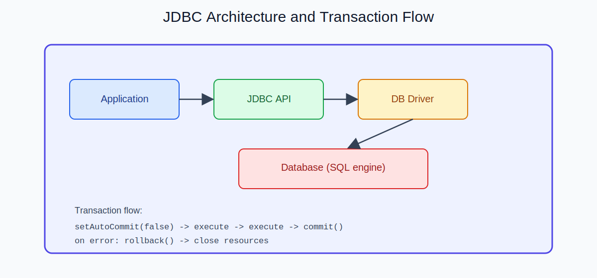
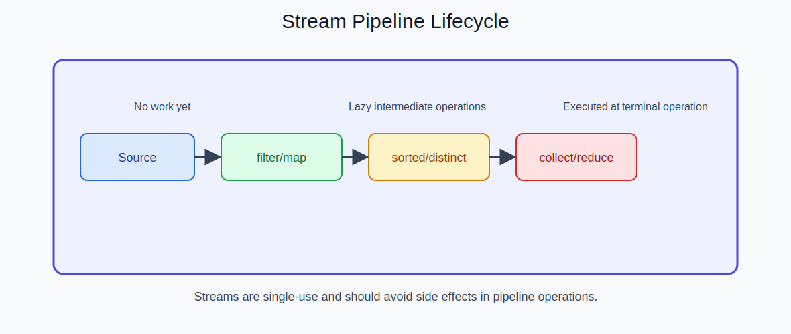
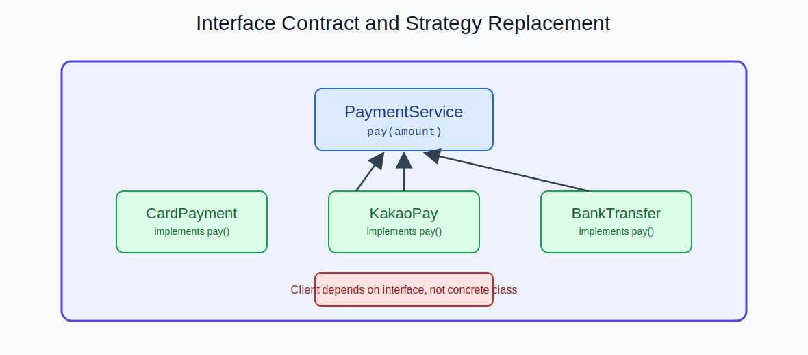

  
CH LECTURE - SLIDE 02

  <h2 style="margin: 10px 0 6px; border: 0; color: #ffffff;">결과물로 말하는 수업</h2>
  

    수업 중 실제로 만든 화면과 구조 자료입니다. 
    "배웠다"가 아니라 "만들었다"로 남깁니다.
  

---

## 실제 프로젝트 화면

<table>
  <tr>
    <td></td>
    <td></td>
  </tr>
  <tr>
    <td></td>
    <td></td>
  </tr>
</table>

---

## 아키텍처/개념 시각화 자료

<table>
  <tr>
    <td>
      
      
<strong>DB 연결과 트랜잭션 설계</strong>

    </td>
    <td>
      
      
<strong>데이터 처리 흐름 최적화</strong>

    </td>
  </tr>
  <tr>
    <td>
      
      
<strong>유지보수 가능한 객체지향 구조</strong>

    </td>
    <td>
      
      
<strong>장애 대응 가능한 예외 처리 체계</strong>

    </td>
  </tr>
</table>

---

  

    단순 강의 노트가 아니라, 실제 코드/화면/설계 문서를 함께 쌓아갑니다. 
    포트폴리오 제출 시 "설명 가능한 결과물"을 확보하는 것이 목표입니다.
  

---

  <a href="./01_후킹.md">← 이전 슬라이드</a>
  <a href="./03_커리큘럼.md">다음 슬라이드: 커리큘럼 →</a>

