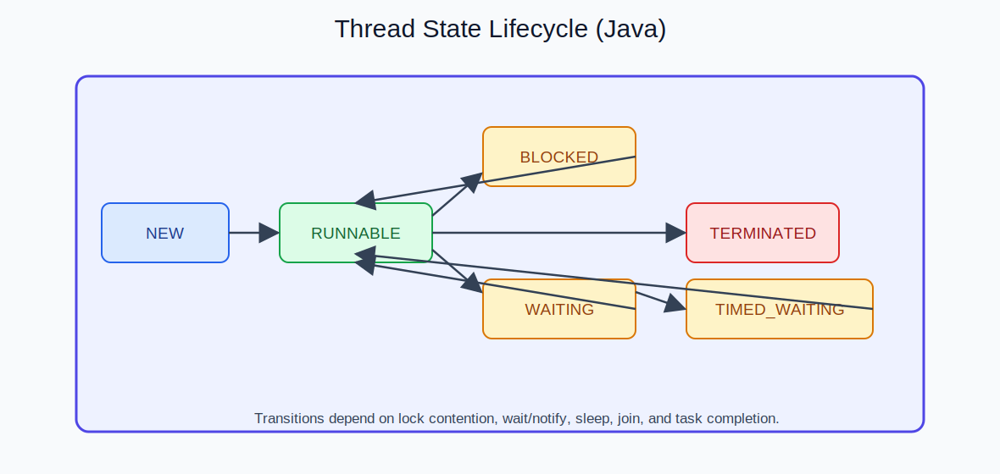

  
CH LECTURE - SLIDE 03

  <h2 style="margin: 10px 0 6px; border: 0; color: #ffffff;">입문에서 실전까지, 끊기지 않는 커리큘럼</h2>
  

    "조각 학습"이 아니라, 실제 서비스 제작 흐름으로 설계했습니다.
  

---

## 단계별 학습 구조

| 단계 | 목표 | 핵심 학습 |
| --- | --- | --- |
| 1단계 | 개발 기초 체력 확보 | Java 문법, OOP, 예외처리, API |
| 2단계 | 웹 프론트 기본기 완성 | HTML, CSS, JavaScript, DOM, 비동기 |
| 3단계 | 서버 동작 원리 이해 | WAS, JSP, MVC, 세션/쿠키, 필터 |
| 4단계 | 실전 백엔드 구현 | Spring, Security, OAuth2, JWT, REST, WebSocket |
| 5단계 | 배포/운영 연결 | Docker, 서비스 운영 관점, 문서화 |

---

## 학습 흐름 시각화

<table>
  <tr>
    <td style="width: 50%;">
      
      
<strong>기초 문법에서 흐름 제어까지</strong>

    </td>
    <td style="width: 50%;">
      
      
<strong>객체지향 설계 감각 형성</strong>

    </td>
  </tr>
  <tr>
    <td>
      
      
<strong>자료구조 선택 기준 확립</strong>

    </td>
    <td>
      
      
<strong>실무 확장 개념까지 연결</strong>

    </td>
  </tr>
</table>

---

## 진행 방식

1. 수강생 목표 설정: 취업/이직/외주/창업 중 우선순위 확정
2. 주차별 구현 목표 지정: 결과물 단위로 진도 관리
3. 코드 리뷰와 리팩터링: 단순 작동에서 실무 품질로 개선
4. 최종 산출물 정리: GitHub 문서화 + 발표 가능한 포트폴리오화

---

  <a href="./02_결과물.md">← 이전 슬라이드</a>
  <a href="./04_콜투액션.md">다음 슬라이드: 신청 유도 →</a>

