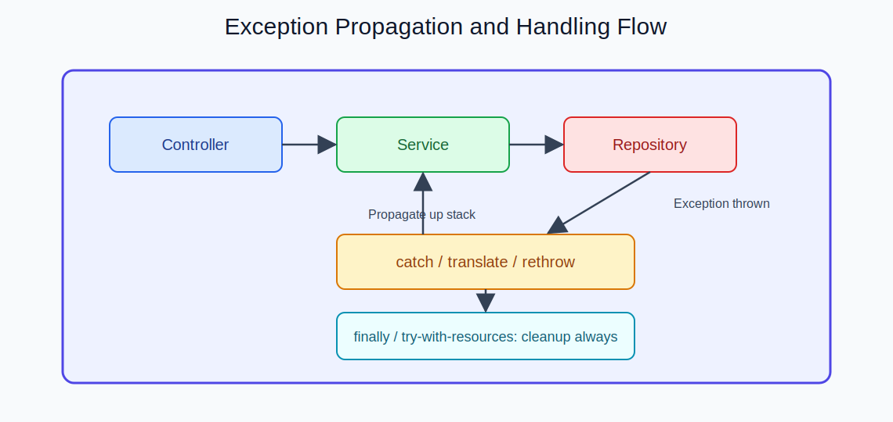

  
CH LECTURE | SLIDE 03

  <h2 style="margin: 10px 0 6px; border: 0; color: #ffffff;">강의 철학: 이해를 넘어, 구현 가능한 실력까지</h2>
  

    단원별 개념 이해 + 즉시 구현 + 코드 피드백을 반복합니다.
  

---

## 강의 소개

<table>
  <tr>
    <td style="width: 32%; background: #0b0b0b; color: #ffffff;">
      
<strong>강의 성격</strong> 오프라인 1:1 실전형 수업

    </td>
    <td style="background: #0b0b0b; color: #ffffff;">
      
<strong>학습 방식</strong> 개념 설명 후 바로 코딩, 기능 단위 결과물 누적

    </td>
  </tr>
  <tr>
    <td style="background: #0b0b0b; color: #ffffff;">
      
<strong>진행 범위</strong> Java → Web → Spring → 인증 → 배포

    </td>
    <td style="background: #0b0b0b; color: #ffffff;">
      
<strong>목표</strong> 취업/실무/외주에 바로 연결 가능한 프로젝트 완성

    </td>
  </tr>
</table>

---

## 수업에 대한 약속

1. 비전공자도 따라올 수 있게 기초부터 단계적으로 진행합니다.
2. 설명만 하지 않고, 수업 중 직접 구현을 끝냅니다.
3. 템플릿 복붙이 아니라 코드 구조를 이해하고 작성하게 합니다.
4. 매 단원마다 리뷰를 통해 작동 코드에서 좋은 코드로 개선합니다.
5. 질문은 막히는 지점 중심으로 바로 해결합니다.
6. 최종적으로 문서화 가능한 프로젝트 결과물을 남깁니다.

---

<table>
  <tr>
    <td style="width: 50%;"></td>
    <td style="width: 50%;"></td>
  </tr>
</table>

---

  <a href="./02_결과물.md">← 이전 슬라이드</a>
  <a href="./04_콜투액션.md">다음 슬라이드: 웹/백엔드 커리큘럼 →</a>

