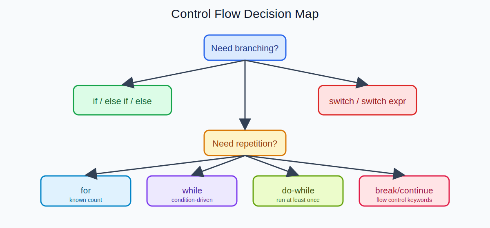
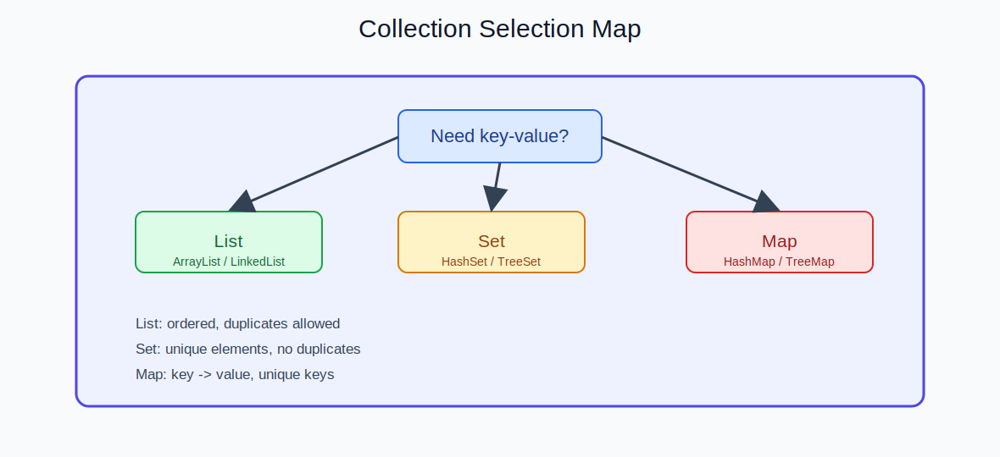

  
CH LECTURE | SLIDE 04

  <h2 style="margin: 10px 0 8px; border: 0; color: #ffffff;">Web. 웹 개념 & 프론트 / Backend. REST API</h2>

---

## Web 트랙 (예시)

1. [1회차] HTML/CSS 기본 구조 + 웹 페이지 뼈대 만들기
2. [2회차] JavaScript 기본 문법 + 이벤트 처리
3. [3회차] DOM 조작 + 브라우저 렌더링 이해
4. [4회차] 비동기 처리 + HTTP 통신(AJAX/Fetch)
5. [5회차] 프론트 미니 프로젝트 구현

---

## Backend 트랙 (예시)

1. [1회차] Java 핵심 문법, 제어문, 메서드, 배열
2. [2회차] 객체지향(클래스/상속/인터페이스) + 예외 처리
3. [3회차] Java API, 컬렉션, 람다, Stream
4. [4회차] JDBC + SQL + 트랜잭션
5. [5회차] Spring MVC + REST API 기본 CRUD

---

<table>
  <tr>
    <td style="width: 50%;">
      
    </td>
    <td style="width: 50%;">
      
    </td>
  </tr>
</table>

---

  
핵심은 "문법 이해"가 아니라 "기능 구현 완료"입니다.

---

  <a href="./03_커리큘럼.md">← 이전 슬라이드</a>
  <a href="./05_서버_프로젝트.md">다음 슬라이드: 서버/프로젝트 →</a>

