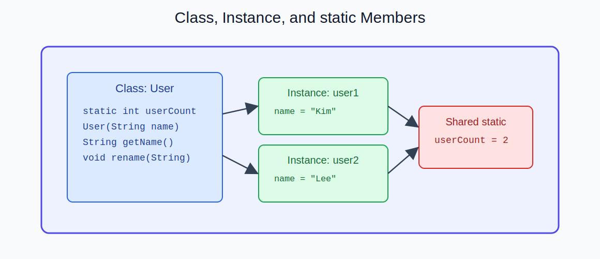
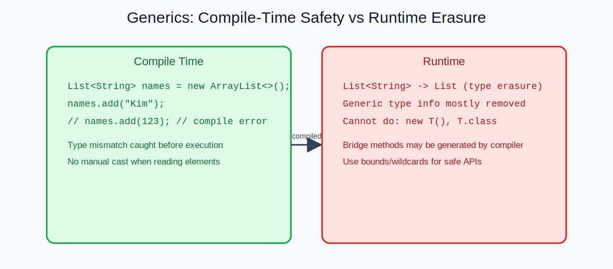

  
CH LECTURE - SLIDE 04

  <h2 style="margin: 10px 0 8px; border: 0; color: #ffffff; font-size: clamp(34px, 5vw, 50px);">6개월 뒤, 내가 만든 서비스가 남게 하자</h2>
  

    더 이상 강의 수료만 하지 말고, 
    직접 설계하고 구현하고 배포한 결과물을 남깁니다.
  

---

## 이런 분께 강력 추천

<table>
  <tr>
    <td style="width: 50%;">
      <h3 style="margin-top: 4px; border: 0;">취업/이직 준비자</h3>
      
포트폴리오를 “설명 가능한 서비스”로 만들고 싶은 분

    </td>
    <td style="width: 50%;">
      <h3 style="margin-top: 4px; border: 0;">외주/사이드 프로젝트 준비자</h3>
      
기획부터 구현, 배포까지 직접 해내고 싶은 분

    </td>
  </tr>
  <tr>
    <td>
      <h3 style="margin-top: 4px; border: 0;">비전공 입문자</h3>
      
기초부터 실전까지 끊기지 않는 학습 흐름이 필요한 분

    </td>
    <td>
      <h3 style="margin-top: 4px; border: 0;">실무 감각 강화 희망자</h3>
      
코드 리뷰, 리팩터링, 테스트 관점까지 훈련하고 싶은 분

    </td>
  </tr>
</table>

---

## 차별점 한 줄 요약

1. 수업 중 바로 구현하고 결과물로 마무리
2. 프론트부터 백엔드, 인증, 배포까지 전체 흐름 연결
3. 1:1 밀착 피드백으로 “완성 가능한 실력”까지 끌어올림

---

<table>
  <tr>
    <td style="width: 50%;">
      
    </td>
    <td style="width: 50%;">
      
    </td>
  </tr>
</table>

---

  <h3 style="margin-top: 0; border: 0;">문의 시 이렇게 알려주시면 바로 설계 가능합니다</h3>
  
현재 수준(입문/중급), 목표(취업/외주/창업), 가능한 학습 시간

---

  <a href="./03_커리큘럼.md">← 이전 슬라이드</a>
  <a href="./index.md">목차로 돌아가기</a>

