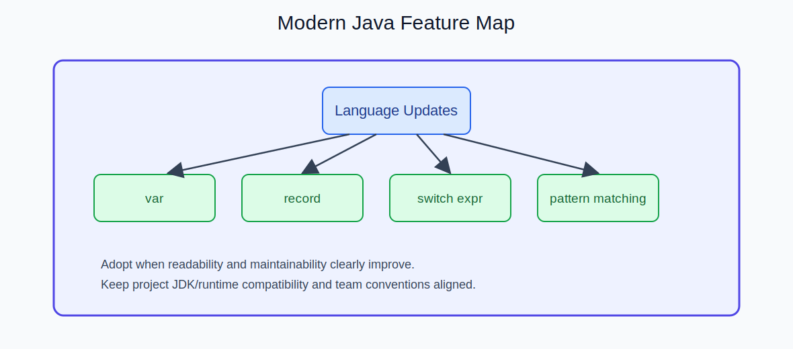

  
CH LECTURE | SLIDE 05

  <h2 style="margin: 10px 0 8px; border: 0; color: #ffffff;">Server. 배포 환경 / Project. 실전 구현</h2>

---

## Server 트랙 (예시)

1. [1회차] 리눅스 기본 명령 + 서버 구조 이해
2. [2회차] Docker 기반 로컬 배포 구성
3. [3회차] 실제 배포 시 고려사항(환경변수, 로그, 보안)
4. [4회차] 배포 문서화 + 장애 대응 체크리스트

---

## Project 트랙 (예시)

1. [1회차] 요구사항 정리 + 화면/기능 설계
2. [2회차] 인증 구조 구현(Session/JWT/OAuth2 중 선택)
3. [3회차] 게시판/댓글/파일업로드 등 핵심 기능
4. [4회차] STOMP/WebSocket 기반 채팅 기능 연동
5. [5회차] 테스트/리팩터링/최종 배포

---

<table>
  <tr>
    <td style="width: 50%;"></td>
    <td style="width: 50%;"></td>
  </tr>
  <tr>
    <td></td>
    <td></td>
  </tr>
</table>

---

  <a href="./04_콜투액션.md">← 이전 슬라이드</a>
  <a href="./06_선택_심화.md">다음 슬라이드: 선택 심화/문의 →</a>

